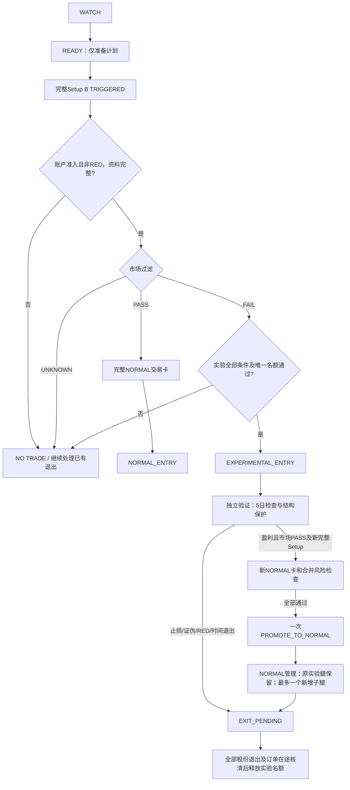

**个人交易系统 v1.2｜正常仓与实验仓分轨执行版**

编制日期：2026-09-14。适用方向：A 股产业预期差、日线趋势确认、个人自有现金账户。

| 项目 | 本版约定 |
|---|---|
| 系统版本 | v1.2 |
| 策略基准 | ThesisGuard v1.3 个人适配草案 |
| 修订依据 | 系统v1.1完整基线，以及用户2026-09-14实验仓需求 |
| 文档状态 | 实验仓规则与执行定义修订版，供登记启用和独立验证 |
| 策略验证状态 | 尚未证明具有净成本后的稳定盈利优势 |
| 实际运行状态 | 以账户启用登记与券商真实记录为准；生成本文不构成实盘启用或订单提交 |
| 默认运行范围 | NORMAL与EXPERIMENTAL共用完整Setup B；普通正常仓不加仓；实验可依第12节一次性升级；不做T；ETF独立管理 |

本版保留v1.1的正常仓市场过滤、Setup、账户额度、退出及记账基线，新增第12节实验机制。实验仅豁免明确的市场过滤FAIL，不豁免UNKNOWN、RED、个股Setup或其他账户风控。实验门槛、升级与退出是待验证的新交易政策；六维评分模型及权重不变。新增动态阈值和歧义处理见第12节，变更明细见附录D。历史文档保留，实际每笔交易绑定事前登记的版本，不能混用旧技能、旧文档的默认参数。

**1. 适用范围与启用登记**

核心流程为：研究证据 → 日线信号 → 价格与数量 → 账户准入 → 委托与成交 → 持仓退出 → 真实现金流 → 复盘验证。

新主动交易使用自有可用现金，不使用融资、借款或其他杠杆。计划持有数周至六个月；价格、逻辑或账户退出可以更早发生。交易次数和回本金额均不作为任务目标。

本文中的 14 万元账户仅为历史背景及计算示例；每次拟单使用当时真实净值 E。既往亏损、资金用途、持仓快照不能由文档版本自动更新。

运行前登记以下资料；没有实盘登记时，只用于研究、历史重演与模拟：

```text
系统版本 / 策略基准 / 运行方式（重演、模拟、小预算实盘）：
启用日期与时刻 / 账户范围 / 初始净值 E0 / 初始单位净值 U0：
现金、持仓、股息应收和全部未结订单核对结果：
外部出入金记录是否完整 / 历史回撤与个人承受度复核：
行情源 / 交易日历 / 复权方法 / 费用方案版本：
券商客户端与条件单能力核验结果：
旧仓管理卡及账户退出优先级生效时间：
实际启用记录 / 记录人 / 保存时间：
```

初次启用可将 U0 设为 1、初始份额 N0=E0/U0。版本升级沿用已有单位净值、高点、暂停记录和恢复周期，不能重新设起点消除回撤。此前已达到个人停手边界时，先完成承受度与资金安排复核，不能凭新建曲线声明恢复常态。

对象分三类，以下分类在整个生命周期内保留：

| 对象范围 | 定义 | 适用规则 |
|---|---|---|
| NEW_ACTIVE | 系统启用后的新主动交易 | 完整准入、固定 R0、持仓退出和账户规则 |
| LEGACY_PRE_MODEL | 模型启用前已有主动持仓 | 独立管理卡；纳入当前 H 与账户风险；不补造原始 R0 |
| LONG_TERM_ETF | 事前登记的长期配置 ETF | 独立配置协议；不套主动结构止损；计入全账户风险 |

NEW_ACTIVE另记录PositionType=NORMAL（正常仓）或EXPERIMENTAL（实验仓/试错仓）。对象范围、仓位类型、AccountRiskState（账户风险状态）是三个不同字段；账户NORMAL不等于仓位NORMAL。旧仓和长期ETF的PositionType为不适用，不能事后改为实验仓。PositionType按入场批次固定，Campaign的当前管理类型另记ManagementMode，详见第12节。

长期续持股票仍是主动交易，不因持有时间变长转入 LONG_TERM_ETF。新增 ETF 投入必须通过账户新增权益限制，其配置理由按独立协议管理，不能借标签绕过暂停。

生益科技旧仓衔接沿用[既有持仓风险卡](../生益科技_持仓风险卡_2026-09-14.md)。该卡记载历史快照为 200 股、成本 142.878 元，用户确认相对成本累计亏损 1,500 元的预算；约 135.38 元是未预留未来卖出费用的历史资金参考，不是最新行情、技术支撑或保证成交价。新交易 0.5%E 预算不自动替代旧仓预算，当前股数、费用、公司行动与保护参数须按实际记录核对。旧仓迁移登记中明确：本系统账户规则正式启用后，账户暂停退出可早于旧仓个股退出条件；文档生成本身不代替该生效登记。

**2. 每日操作速查与决策顺序**

| 时点 | 固定工作 | 记录结果 |
|---|---|---|
| 盘前 | 核对账户状态、未结订单、可卖数量、新事件、当天有效保护价；核对 t+1 入场卡 | 当日动作清单：允许动作、触发条件、数量上限、待处理事项 |
| 盘中 | 按冻结计划执行；触发退出即处理；核对成交、拒单、撤单与剩余数量 | 事件与成交原始记录；必要时更新账户状态和订单预占 |
| 收盘后 | 对账；更新单位净值、D、H；生成次日保护价；计算完整日线信号；记未成交原因 | 持仓/订单表、净值账本、候选池及次日计划 |
| 每周 | 核对风险、压力情景、计划覆盖及执行错误、投入时间 | 周复盘及未解决事项 |
| 每月 | 检查已公布的经营证据、预期差兑现与版本表现 | 证据更新和策略观察；不假设月度必有新财报 |

盘中发现新信息可暂停新增或触发退出；不能借新信息临时提高预算、扩大数量、追过 Pmax、下移经济保护位或将亏损仓改名为长期仓。

动作按以下顺序判断，已触发退出不因后续研究或统计尚未完成而等待：

1. 核对可交易条件、真实订单与成交状态，处理账户硬暂停及已有退出事件。
2. 检查账户是否存在未解除暂停、EXIT_PENDING、未知风险或在途异常；按第 6 节决定能否新增。
3. 对拟新增动作检查市场、研究、Setup、事件、价格、数量及组合额度。
4. 全部准入通过才可执行冻结计划；否则记原因并继续管理现有仓位。

市场过滤FAIL阻止新的NORMAL入场；可按第12节审核EXPERIMENTAL。市场过滤FAIL本身不单独触发已有NORMAL持仓卖出；EXPERIMENTAL新增的市场恶化退出依第12节执行。市场RED同时否决两类新增及升级，不因高评分特批。价格与逻辑退出为“任一成立即退出”，不需要等待另一条件确认。有效恢复状态是账户 7% 暂停规则的有限例外，具体优先级见第 6 节。

**3. 候选研究、数据口径与六项准入**

主要研究对象为产业趋势型公司，产业事件可以提供证据。纯情绪题材没有因此获得本版开仓资格。六维评分模型及权重保持不变，NORMAL仍只用于研究排序；EXPERIMENTAL另要求有完整证据的总分≥70：产业景气 20、盈利质量与季度加速度 25、订单/产品竞争力 20、财务质量 15、估值合理度 10、市场确认 10。权重固定；缺少可靠证据或评分锚点时记 UNKNOWN，不输出可交易总分，不设置“高分特批”。

每个候选至少保存一项可核对的产业/经营变化、一项预期差依据、下一次验证日期和明确的逻辑证伪事实。每条证据保存来源链接或原始材料、发布日期与取得时间；区分事实、推断和假设，AI 预测、传闻和他人推荐不能替代证据。

比较自有预测与一致预期时，统一年度、利润口径、币种及信息时点。一致预期利润为正才计算 `(自有预测−一致预期)/一致预期`；零或负基数时该比率不适用，使用绝对变化与情景说明。没有可靠一致预期可以使用有来源的其他预期差证据，无法说明预期差则继续观察。

目标 T 必须在下单前独立说明依据，例如前高、压力区或有计算过程的盈利/估值情景；不能用“买价加两倍止损距离”倒推出 T 再宣布 RR 合格。没有可靠目标为 UNKNOWN。

统一数据约定：

- 证券、指数使用登记的数据源、交易日历和完整日线；MA 为收盘价简单移动平均。信号、指标与证据均保存信息截止时点。
- 股票 OHLC 与移动平均采用同一复权尺度；历史重演只使用对应时点已知的公司行动及因子。原始报价、转换方法与版本须留存。
- 交易日索引按登记的交易所日历；停牌、缺失、无有效成交的数据保留状态，不把占位值或人工补零当成满足条件的正常日线。指标窗口所需有效数据不足为 UNKNOWN。
- 成交量统一单位并记录供应商的公司行动处理方式，成交额以真实人民币金额计算。不同来源或不同调整口径不能无说明混接。
- 实际委托使用生效日真实未复权报价。公司行动转换适用于全部价格阈值与相关数量，按第 9 节处理。

NORMAL六项准入全部通过才允许拟单；FAIL、UNKNOWN或不接受计划亏损均为NO TRADE。EXPERIMENTAL仅把表中市场过滤PASS替换为第12节完整实验准入，个股Setup及其余各项仍须PASS。共同RED否决始终先执行：

| 准入项 | 必须保存的判断 |
|---|---|
| 研究 | 产业变化、预期差、来源时点、验证日及证伪事实完整 |
| 市场与信号 | 前一完整交易日双指数过滤 PASS，完整日线 Setup B TRIGGERED |
| 价格与数量 | 同尺度 S0、Pmax、T、预算 B 与最大合法数量齐全 |
| 空间 | 当前计划数量下扣成本 RR≥2，T 有独立依据 |
| 退出与事件 | 触发、委托、可卖限制、有效期、异常处理及已知事件方案已核实 |
| 账户与执行意愿 | 当前状态和拟交易后全部额度允许，无阻断新增的未处理事项，接受计划损失 |

财报、业绩预告、合同、解禁、减持、监管、公司行动及与持仓相关的重要政策事件，按已知日程和可靠公告检查。未评估的已知重大事件阻止新开仓；已确认逻辑证伪按退出处理，未核实传闻先核实并暂停增加相关风险。

**4. 两类仓位共用的个股Setup：B 日线回踩确认**

Setup A、Setup C、60 分钟确认及其他入场分支仅作观察。本节阈值为继承的候选定义，不代表经优化得出的最优参数。

设 t 为信号确认交易日；High、Low、Close 为同尺度日线数据。所有窗口均包含写明的起止日期。

| 步骤 | 唯一判定口径 |
|---|---|
| NORMAL市场过滤 | 拟入场日的前一完整交易日，沪深300与中证1000均满足 Close>MA60；任一不满足为FAIL。EXPERIMENTAL只能在此项明确FAIL时走第12节，不改变本指标定义 |
| 趋势 | `Close(t)>MA20(t)>MA60(t)` 且 `MA20(t)>MA20(t−5)` |
| 回踩起点 p | 在 `t−20…t−1` 中取最高价所在日，同高取最近日；必须 `p≤t−2` |
| 回踩区间与低点 | 区间 `p+1…t−1`；最低价为 L，最低价所在日同低取最近日 d |
| 回撤幅度 | `3%≤[High(p)−L]/High(p)≤12%` |
| 均线位置 | `−3%≤L/MA20(d)−1≤3%` |
| 缩量 | 回踩区间平均日成交量≤`p−19…p` 的平均日成交量 |
| 收盘确认 | `Close(t)>High(t−1)`；盘中越过不构成确认 |

个股趋势至收盘确认全部满足才记Setup=TRIGGERED；市场过滤独立记录，不混入个股Setup。尚未完成日线只记READY。NORMAL需要市场PASS；EXPERIMENTAL须市场FAIL且第12节全部实验条件通过。READY只可准备计划，不允许任一类型实际入场；不增加MA10或平台支撑替代分支。

先把 L 换算到入场日真实报价尺度，S0 为严格低于该值的最近合法报价。固定报价单位为 tick 时可写为 `tick×[ceil(L/tick)−1]`，使用十进制定点计算并核对适用报价规则。L 恰为 50.00 元、tick 为 0.01 元时，S0=49.99 元；L=50.004 元时，S0=50.00 元。不得为了买得更多而人为缩窄结构保护距离。

信号对应的入场窗口仅限 t+1 交易日。下单前冻结 S0、T、Pmax 和 q_plan：

```text
P = Pmax = 本次计划选定的合法入场价格上限
Pmax ≤ 转换到执行日尺度的 Close(t) × 1.01
S0 < 允许成交价 ≤ Pmax
在该 Pmax 和 q_plan 下，费用后 RR ≥ 2
```

1% 是最高容差，不要求把买入限价设到该上限。Pmax、数量与 RR 相互约束，须联合核算；同一笔订单不会因为成交价较低就自动增加股数。价格超出上界不追价；首次入场前低于或曾触及 S0 的旧信号不可买。

从 t 收盘确认到初始建仓结束，若有效行情曾触及或跌破 S0、可信来源确认逻辑证伪，或账户发生要求该入场终止的暂停事件，本信号失效并保存原因。剩余买单撤销，已成交部分按第 7 节处理；之后反弹、次日到来不恢复旧信号。仅入场期限到期而没有失效事件时，取消未成交余额，已成交部分按原计划管理。

**5. 金额、股数与组合风险的统一计算**

| 符号 | 单位与含义 |
|---|---|
| E | 元；当前同一估值时点的全账户净资产，含现金、证券及应收应付调整 |
| B | 元；本次实际使用的计划风险预算；NORMAL按当前有效账户额度，EXPERIMENTAL按第12节取正常预算一半 |
| P / Pmax、S0、T | 元/股；计划入场上限、初始保护价、有依据目标，使用同一执行尺度 |
| q_plan、q0、q_rem | 股；冻结计划数量、初始阶段累计实际买入数量、当前剩余持仓数量 |
| Entry0 | 元/股；初始买入阶段真实成交的加权均价，不使用被做T等操作改变的券商显示成本 |
| r0 | 元/股；`Entry0−S0`，必须为正；留存初始尺度原值 |
| R0 | 元；成交核清后冻结的初始计划风险金额，是整笔交易 R 统计的分母 |
| H | 元；未触发退出的主动持仓，从现价到当前有效保护位的计划风险 |

账户额度只规定上限，没有必须买满的最低仓位。常态参数及降档参数统一见第6节。第6节的单笔额度是normalRisk来源；实验按experimentalRisk=normalRisk×0.5计算，仍合并进入同一H、产业、权益、现金及恢复空间限制，不另发组合额度。

**费用与合法数量。** F_loss(q) 为 q 股计划往返费用、税费及不利成交偏离预留；F_target(q) 为到目标情景的对应成本预留，单位均为元。费用方案保存佣金、最低收费、税费、适用品种、拆单影响和取得日期；费率按实际券商记录核实，不假设费用与成交金额始终成正比。

选择符合证券实际申报规则、且同时满足下列条件的最大数量，作为可用上限 q_plan；可以选择更小数量，但须重算最低费用和 RR：

```text
q × (P − S0) + F_loss(q) ≤ B
RR = [q × (T − P) − F_target(q)] / [q × (P − S0) + F_loss(q)] ≥ 2
拟新增动作后的单股市值 ≤ 25% × E
拟新增动作后的权益总市值、主动风险、产业风险满足第6节额度
全部待成交买入所需现金及费用 ≤ 统一可用现金池（含纳入校验买单的已冻结资金，定义见下文）
本笔计划持仓金额 q×P ≤ 此前20个完整交易日平均日成交额的0.5%
```

按合法数量逐档核算；最小数量仍不通过则放弃。不提高预算凑数量、不向上凑一手、不改结构价凑仓位。流动性比例是候选限制，不保证极端行情可退出。

**当前持仓风险。** 对没有退出触发、保护参考有效的主动持仓，在同一估值时点计算：

```text
H_i = q_rem_i × max(M_i − S_i, 0) + F_exit_i
H = ΣH_i
H_sector = 同一主要产业驱动下的 ΣH_i
```

M_i 为现价，S_i 为当日有效保护价，F_exit_i 为剩余股份预计退出费用与不利成交偏离预留。各仓风险不得为负，不用盈利仓抵消其他风险；旧仓纳入 H，原始 R0 不存在不影响当前 H。每只股票事前登记主要产业驱动，PCB、CCL、AI 硬件等不能仅因名称不同被强行拆散；无法明确相关性时暂按共同主要驱动核查，记录分类依据。

长期 ETF 不设本模型主动保护价，排除在 H 分子之外，但始终计入 E、权益市值、D 和压力情景。主动仓缺有效保护参考则 H=UNKNOWN，禁止新增主动风险。EXIT_PENDING 单独显示剩余市值与压力情景，不用已失效的保护价算成零风险；存在此状态时禁止新增主动风险。

**在途订单预占。** 下单前，以“已成交持仓＋所有有效买单的未成交部分＋本次拟单”计算全部成交情景。现有证券按同一时点现价估值，未成交买入按其冻结价格上限计入市值；逐笔预占尚需现金、风险和产业额度。

```text
未成交风险预占 H_order_j
  = q_unfilled_j × max(Pmax_j − S0_j, 0)
    + 尚未支付的买入费用及对应退出费用/偏离预留
拟交易后主动风险 = H + ΣH_order_j（含本次拟单）
```

H_order仅用于主动入场买单；长期ETF买单预占现金和权益市值，不虚构S0计算主动H，其市场风险继续进入全账户情景。

现金检查统一使用同一时点口径：`CashPool=券商当前可用资金+本次纳入校验的既有买单已冻结金额`，再比较“所有既有买单未成交部分及本次拟单的现金与费用需求之和≤CashPool”。已用于其他用途、未纳入本次买单校验的冻结资金不加回；券商可用资金若已扣冻结额，不能一边直接用这个余额，一边又完整扣一遍已有买单。冻结额与可用额无法核对时，现金准入为UNKNOWN。

买入已成交部分只进入持仓占用，未成交部分只进入订单占用，同一股数不双计或漏计。费用按实际拆单方案保守预留，不能漏掉最低收费；真实盈亏账本只扣实际发生的成本。禁止把预期但未成交的卖出收入当成已释放资金或仓位。

撤单请求发出时继续预占；订单终结且在途成交核清后，才释放确定未成交部分。回报或持仓同步不确定时暂停下一张主动入场单，先对账。每次后续委托与数量变更前重算当前额度，原计划上限不得提高；额度下降导致新增部分不合格时撤销剩余买入，已成交部分依退出条件管理。

市值上限约束新增动作。自然上涨或账户降档造成已有仓位超限时，先停止增加相关风险，按既有退出协议和周度配置复核处理；不为使表格合格而无依据上移保护位或每天机械减仓。账户硬暂停引发的退出按第 6 节单独执行。

每周至少记录“全部股票与股票 ETF 同跌 20%、现金不变”的情景损失，以及已知事件跳空风险。20% 为统一对照，不是最坏损失；情景不假设止损必能成交。H、B 和压力情景分别回答不同问题，均不是账户实际损失保证。

**6. 单位净值、回撤、暂停与有限恢复**

账户金额 E 用于当下额度，单位净值 U 用于收益与回撤。保存按时间排序的现金流、证券估值、股息应收、费用和份额账本；同一权益不能在应收和到账现金中重复计入。外部转入为正 C、转出为负 C：

```text
U_before = E_before / N_before
N_after = N_before + C / U_before
E_after = E_before + C
U_after = E_after / N_after = U_before（只有外部转账时）
```

投资盈亏、股息和费用属于投资结果，不增减份额。每次出入金使用发生前单位净值；多次转账也不能重置启用起点、高点或恢复起点。全部出金造成份额为零、净值不可得或账本不平时，U/D 标待核对并暂停自动准入；保存历史状态，后续入金不得自动新建无历史账户。

```text
U0 = 系统首次启用的单位净值，版本升级不重置
Upeak = 启用后截至当前已记录的最高单位净值（含U0）
累计损失比例 = max(0, 1 − U/U0)
高点回撤比例 = 1 − U/Upeak
D = max(累计损失比例, 高点回撤比例)
```

净值、D 和账户状态每个收盘更新；拟新增动作、转账后或盘中识别到重大净值变化时，使用可核实的同一时点快照重算。历史高点为该记录频率下的已观测高点，未取得的盘中极值不得声称已覆盖。无法得到可靠状态时不新增风险。

**正常区间额度表。** 无未解除的暂停事项、且没有有效恢复状态时，按 D 唯一区间取额度：

| 状态 | D | 单笔 B 上限 | 主动 H 加订单预占上限 | 新增后权益总市值上限 | 动作 |
|---|---|---:|---:|---:|---|
| NORMAL | 0%≤D<3% | 0.5%E | 2%E | 50%E | 通过准入才可新增 |
| WARNING | 3%≤D<5% | 0.25%E | 1.5%E | 40%E | 降低新增风险并复核原因 |
| CONTRACTED | 5%≤D<7% | 0.125%E | 1%E | 30%E | 低预算验证，最小数量不可行则不交易 |
| PAUSED_DD | D≥7% | 0 | 禁止增加 | 禁止增加 | 撤销新增权益买单，核查在途成交；主动仓首个可执行时点退出 |

同产业风险上限始终为 `min(1.5%E，当前有效状态的主动风险上限)`，恢复状态也适用。新增 ETF 同受新增权益市值和账户状态限制。既有长期 ETF 不因主动交易暂停自动择时卖出，仍进入单位净值、回撤和压力情景。

**暂停事件锁定。** 每次事件保存 ID、原因、触发时刻、要求动作、未结订单、整改与解除记录。以下是额外控制，不能仅凭 D 回到较低档位自动清除：

| 事件 | 新增约束与现有持仓动作 | 解除条件 |
|---|---|---|
| 人为违规：计划外买入、超数量、摊低成本、扩大预算/止损、拖延退出等 | 暂停下一笔新增主动风险，取消相关剩余入场委托；已有退出继续执行；正在建仓的该笔按暂停终止处理 | 核对订单与实际风险、纠正原因、重演相关流程，按当时账户状态登记恢复 |
| EXIT_PENDING 或订单/主动 H 无法核实 | 暂停新增主动风险；处理退出、回报和数据异常 | 退出完成或异常核清；其他暂停原因也已处理 |
| D 首次达到7%且无有效有限恢复例外 | 暂停全部新增权益风险，撤买单核在途，主动仓首个可执行时点退出 | 按下述有限恢复流程，或另行形成有记录的方案 |
| D≥10% | 暂停全部新增权益风险，处理主动仓 | 重新评估个人承受度及资金安排，另立方案；本版不提供自动恢复额度 |

报价跳空、停牌、T+1、部分成交等客观限制单列原因，不能直接归为人为拖延；发现限制后仍应持续处理，而非忽略订单。反弹、次日、跨月、一次盈利或仅写完复盘均不自动解除暂停。

**有限恢复 RECOVERY。** 这是对 D≥7% 暂停的显式、有限例外，不清除历史 D。进入前须同时满足：D<10%；既有主动仓及入场订单已处理；没有 EXIT_PENDING、未纠正违规或未知风险；完成原因复盘、控制修正及用当时可知数据重演计划与退出；没有已耗尽而试图自动续发的恢复周期。

登记固定 `RecoveryID、起点单位净值 Urec、开始时间、整改依据`，采用：

```text
单笔 B ≤ 0.125%E
主动 H + 订单预占 ≤ 0.25%E
拟新增后权益总市值 ≤ 15%E
同产业风险上限 = min(1.5%E, 0.25%E)
Lrec = max(0, 1 − U/Urec)
```

有效 RECOVERY 中，D 仍≥7% 不再次自动否定这一例外；继续按恢复额度管理。任何价格/逻辑退出、EXIT_PENDING、执行违规、D≥10% 或恢复预算触发优先于恢复准入。

Lrec 首次达到 **0.5%** 即将该恢复周期标为耗尽，暂停全部新增权益风险，撤买单核对在途并处理主动仓；全局 D 达到10%同样暂停。该 0.5% 是相对固定 Urec 的累计净损失阈值，不是逐笔亏损相加，也不是每月预算或恢复期新高回撤。跨日、跨月、转账、再次复盘不重置 Urec；触发后反弹也不能解除耗尽状态。

恢复期拟单同时核查剩余空间：`RecoveryHeadroom=max(0, N×[U−0.995×Urec])` 元；拟新增后的主动 H 与订单预占还须不超过该空间，单笔 B 同时受其约束。该检查避免已接近停止线时仍按满额承担新计划风险，不能覆盖 ETF 波动或保证退出成交。此项是本版对累计预算的执行补全，不改变0.5%阈值。

恢复期因执行问题暂停而预算未耗尽时，整改后仅可沿用原 RecoveryID 和 Urec 继续；预算耗尽后仅继续研究与模拟，若要再次实盘须重新评估承受度和规则并另立方案，不能自动发放新周期。D<5% 且复核通过后，才登记结束恢复并回到正常区间额度；结束事件保留，不能靠切换状态续发旧预算。

若既有长期 ETF 已超过恢复期 15%E，则没有新增空间，不据此要求自动卖 ETF。3%/5%/7%、10%及恢复政策均为候选风险管理边界，实际亏损可因跳空或无法成交超过阈值。

**7. 从信号到成交：订单与持仓分开记状态**

信号、订单和持仓采用三个字段；部分成交时，订单未结束不代表没有持仓：

| 字段 | 状态 |
|---|---|
| 信号 | WATCH / READY / TRIGGERED / EXPIRED / INVALIDATED |
| 入场订单 | PREPARED / SENT / PARTIAL_FILLED / CANCEL_PENDING / FILLED / CANCELLED / REJECTED / UNKNOWN |
| 持仓 | NONE / OPEN / EXIT_PENDING / CLOSED |

每笔完整交易设置 TradeID，信号另设 SignalID，订单保存券商原始 OrderID；多条成交、撤改单或部分退出都归入原 TradeID。同一证券已有未结主动入场、NORMAL、EXPERIMENTAL或旧主动仓时，不以新TradeID新开任一类型来绕过不加仓限制。唯一例外是第12节事前批准、绑定同一Campaign且最多一次的EXPERIMENTAL→NORMAL新增决策。

下单前核实证券的交易权限、申报数量、递增单位、报价单位、允许委托类型、有效价格范围和可卖时点。不能把全市场统一按100股处理；例如科创板限价申报单笔不少于200股，超过部分可按1股递增，余额卖出另有规则。[上交所科创板交易问答](https://edu.sse.com.cn/tib/qa/)

退出能力核验记录：触发行情来源、提醒还是自动委托、终端在线要求、实际可监控时段、委托类型、有效期、可卖数量、拒单/断线/未成交处理及核验日期。未核实为 UNKNOWN，不通过新交易准入；不通过提交“测试用”实盘订单来学习功能。

**入场执行步骤：**

1. t+1 下单前复核冻结卡和当天可用额度，分配订单预占。新事实使准入不通过则停止发送。
2. 提交不超过 Pmax、q_plan 的有效委托，记录真实回报。报价较低不增加数量；修改或拆单必须符合原计划上限、窗口及当前额度。
3. 每条成交立即更新已买数量、可卖数量、持仓风险及未成交预占。不能等买满后才管理退出。
4. 出现撤单或期限事件，执行下面的分支；撤单尚未确认期间持续核对迟到成交。
5. 全部初始买单终结、在途成交核清且不会再增加初始买入数量时，记“初始建仓结束”，冻结 q0、Entry0、r0、R0。

| 事件 | 未成交部分 | 已成交部分 |
|---|---|---|
| t+1 窗口到期，信号无失效事件 | 撤余单，核清后记 EXPIRED，不跨日补足 | 按原计划管理，不因没买满强制退出 |
| 有效价格触及 S0、逻辑证伪或该入场遭账户暂停终止 | 记 INVALIDATED，撤余单核查在途 | 进入 EXIT_PENDING，按可卖限制处理全部相关股份 |
| 仅新增额度不足、资料缺失或新增条件不再允许，未出现持仓退出条件 | 取消未成交新增动作，记录原因 | 按原持仓退出协议继续管理 |
| 拒单或状态 UNKNOWN | 先核对券商状态，不能假设零成交并重复发单 | 已知成交照常管理；状态无法确定时暂停新主动入场 |
| 撤单请求后又收到成交 | 先把迟到成交归入原买单，重新核对剩余量 | 若撤单因失效，则迟到成交同样进入退出；若仅到期，按原计划管理 |

当日不能合规完成的旧信号不留到次日补足。后续重新入场必须形成新的完整信号；已有主动仓时仍受第一轮不加仓约束。

**初始风险冻结。** q0 是该初始阶段累计真实买入股数，Entry0 按这些买入成交加权，不因期间已经卖出部分而扣减 q0。按初始同尺度 S0 计算：

```text
r0 = Entry0 − S0
R0 = q0 × r0 + 实际已付买入费用
     + 依事前费用方案为q0核定的计划卖出费用及不利成交偏离预留
```

完成全部计划数量，或仅部分成交后结束初始买入，都可以完成冻结；计划总数不等于 q0。保存 B_plan、q_plan、实际 R0 和偏差原因，R0 后续不因盈利、移动保护、部分退出或换版本重置。

若退出已触发，先退出，R0 暂标待核定；买入回报核清后按原始计划计算，不能用已经发生的卖出亏损反推分母。真实成交造成超预算或 Entry0≤S0 时记录异常，不修改 S0 使其合规。r0≤0、缺少事前保护或费用依据不可核实，则相应风险尺度标 UNKNOWN/不适用，真实金额结果保留，不能拿 B 改名为 R0。

**8. 持仓、盈利保护与退出协议**

普通NORMAL仍不主动加仓；EXPERIMENTAL不补仓、不摊低成本，只可依第12节完成一次升级新增决策，此为明确的有限例外。任何类型均不做亏损摊低成本，不固定减仓1/3。客观部分成交属于一笔初始建仓，不可借此扩大原 q_plan。常规退出处理整笔剩余持仓，客观部分退出逐批记录。

**价格退出：**盘中可靠有效行情触及或跌破当日有效保护价即触发，记录为 EXIT_PENDING。对可卖数量在首个可执行时点提交预定退出方式，不等收盘、反弹或第二次确认；开盘跳过保护价同样按触发处理。触发价与委托价分开，挂单不等于成交。

**逻辑退出：**事前登记的证伪事实由可信来源确认，在首个可执行时点退出，不等技术价格触发。未核实信息记录核实任务，不将已经证实的坏消息无限期记作待观察。

**NORMAL盈利保护（EXPERIMENTAL适用第12节专门协议）：**原始启动阈值为 `Trigger2_original=Entry0+2×r0`，使用每股风险 r0，不使用金额 R0。实际比较使用 `Trigger2_effective(k)`，即把该原始阈值按截至交易日k已知公司行动转换后的当日报价等价值；无公司行动时等于原值。某日收盘首次满足 `Close(k)≥Trigger2_effective(k)` 后，永久记录“盈利保护已启动”，从下一交易日起执行5日低点保护，价格回落不关闭该状态。

```text
在交易日 k 开始前：
  将此前 k−5…k−1 五个完整交易日低点转换到 k 日同一尺度
  CandidateStop = 严格低于这五日最低价的最近合法报价
  S_effective(k) = max(已换算的旧有效保护价, CandidateStop)
```

当天有效价在开盘前计算并保存生效日，盘中不拿尚未完成的当日低点重算。启动前沿用初始有效保护价；公司行动转换另按第9节处理。数据不足时保留仍有效且已核实的原保护安排，暂停新的保护价计算并列异常，不伪造候选价；已触发退出照常处理。

“不得下移保护价”指同一经济价值尺度上不得放宽保护；除权换算不属于人为放宽。达到目标 T 时复核估值与 Thesis，留记录，本轮不设置到T自动卖出的第二套选择；若事前逻辑退出条件已满足则按逻辑退出执行。计划 RR 是空间筛选，不等于实际平均盈亏比。

**NORMAL时间管理（EXPERIMENTAL先适用第12节5日验证及有限延期）：**首个实际买入交易日计为持有第1个交易日。原始检查阈值为 `TriggerHalf_original=Entry0+0.5×r0`；每次判断使用对应日期已换算的 `TriggerHalf_effective`，不能将原始价格直接与除权后报价比较。在第10个交易日收盘检查，自实际入场后是否曾触及当时同尺度的该阈值；未出现记 TIME_DECAY，复核买点和论据，本标签不自动卖出、不放宽保护。精确持仓时段数据不足记 UNKNOWN，不把入场前当日高点当作已达到。

交易卡在入场前登记不晚于首笔买入后六个日历月的强制复核日期；非交易日的执行顺延到首个可执行交易日。没有事前续持协议，复核到期按计划退出。

申请续持的交易须事前附：资金可用期限、至少两项可核对业务指标及阈值、估值情景、风险预算、复核日期及退出条件。到期同时满足指标、逻辑未失效、未触发价格或账户退出、资金期限足够，才可登记下一次不晚于三个月的复核。任一不满足或 UNKNOWN 则退出。多次满足可以继续持有，但始终是原主动交易，沿用 TradeID、原 R0、保护位和账户限额；不能因套牢事后补出续持资格。

**退出未完成：**T+1、停牌、跌停、跳空、拒单、流动性不足及部分成交分别记录。核对触发时间、委托状态、成交量、剩余量、可卖量与下一可执行时点；原委托状态未明时不重复提交导致数量冲突。普通A股当日新买入部分存在当日卖出限制，实际按证券与券商可卖数量执行，不能假定止损当日必能成交。相关交收前卖出限制及品种例外见[上交所现行交易规则发布页](https://www.sse.com.cn/lawandrules/sselawsrules2025/stocks/exchange/c/c_20260424_10816482.shtml)。

退出触发状态锁定至全部相关股份处理完毕；后续反弹不撤销退出理由。订单有效期到期时按事前协议重新核对和处理剩余量，不能因订单到期而把持仓改回正常。EXIT_PENDING 期间禁止新增主动风险，持续披露剩余市值与压力情景。

**9. 公司行动与价格尺度连续性**

保留原始 q0、Entry0、S0、r0、R0；另维护公司行动后的当前数量与等价价格阈值，原始金额 R0 不重置。每次转换保存公告、除权日期、每原股权益、因子和报价取整结果。

在信号至执行之间发生送转、拆并股或现金分红时，同步转换 L、S0、Pmax、T，并重算合法数量、费用和RR；新计划 q_plan 在下单前重新冻结。已发送订单核对券商是否调整或撤销，不能假定系统自动处理正确。

持仓阶段须同步转换全部仍有效的价格阈值，包括尚未触发的盈利保护启动价、TIME_DECAY检查价、已启动保护的有效价和滚动比较数据；原始Entry0、r0及阈值留存，实际判断使用当日同尺度的等价值。先将新旧保护价换到同一经济尺度，再比较是否收紧。机械除权导致名义价格下降不记人为扩大止损。

仅以“一原股变为a股、每原股获得税前现金c”的简单公司行动为例，忽略其他权益时，相同经济价值的价格水平 x 转换为 `(x−c)/a`，数量乘a，每股风险距离相应除以a；价格水平和价格距离不能都简单减c。这个示例不覆盖配股缴款、复杂重组等情形，实际使用经公告与数据源核对的转换。

持仓期经济保护价转换后，按合法报价选择不放宽保护的有效值并保留取整偏差；新的结构低点候选仍按第4节“严格低于低点”规则计算。无法核对时阻止新入场，现有持仓列为管理异常，核对券商与公告；不能把“数据未知”解释成忽略已知退出条件。

股息在权益归属后依会计口径计入应收，到账时由应收转现金，不能重复计收益。税费按实际扣缴/应付调整；仅报价机械除息不当作经济损失。复杂公司行动或部分退出使用批次与现金流账本，价格简式不直接套用。

**10. 交易分类、净盈亏与复盘统计**

事前准入和事后执行分别记录：

| 字段 | 值与规则 |
|---|---|
| 对象范围 | NEW_ACTIVE / LEGACY_PRE_MODEL / LONG_TERM_ETF |
| PositionType / EntryRoute | 原始批次NORMAL或EXPERIMENTAL；路由NORMAL_DIRECT / EXPERIMENTAL / NORMAL_PROMOTION，原始身份不可覆盖 |
| EntryClass | 按各自事前准入记MODEL_IN / MODEL_OUT / UNCLEAR；完整符合实验规则的市场FAIL交易可为MODEL_IN，旧仓和ETF不适用 |
| Execution | COMPLIANT / EXECUTION_ERROR / UNKNOWN；同时保存违规时点与具体动作 |
| 客观限制 | T+1、停牌、跌停、拒单、迟到回报等独立标签 |
| 结果 | 实际金额盈亏、净R可用性与数值；盈利不能抹掉违规 |

入场合规但拖延止损：EntryClass仍为MODEL_IN，Execution记EXECUTION_ERROR。补证只可依据当时已存在、可核对的资料，保存修订历史；不能按后来涨跌改写准入。旧仓不追溯入场违规，也不补造原始风险分母。

完整交易为从初始买入到最终退出的一次 TradeID 生命周期；部分成交/退出不拆成多笔胜负。买卖价款与费用分栏记录，避免净成交额已经扣费后再扣一次。全部实际新交易，包括违规交易，均进入金额结果和账户账本。

```text
最终净盈亏 = 累计卖出价款 + 归属本交易的股息及其他投资现金流
             − 累计买入价款 − 实际全部交易费用与税费
R_net = 最终净盈亏 / 冻结R0（仅R0完整可核实时）
```

归属股息应收或税费未结清时，结果标暂估并列未结项，待核定后按原 TradeID 修订；金额账本保留应收应付。尚持仓交易显示已实现和未实现结果，不混入已完成交易的胜率。无事前风险记录的交易 R0/R_net=UNKNOWN，实际金额不丢失；不得事后倒算止损、用预算B替代R0，或将UNKNOWN填成0。

**MFE/MAE。** 无公司行动、无自主加减仓且股数已固定的持仓段，用实际持有时段计算：

```text
MFE_price = max(0, 持仓期最高价 − Entry0) / r0
MAE_price = max(0, Entry0 − 持仓期最低价) / r0
```

首次入场前、最终退出后的当日行情不属于精确持仓时段。仅有日线无法分辨时，标近似/范围或UNKNOWN，不伪称精确值。持仓期MFE与退出后观察分开；退出后20个交易日表现作为固定研究窗口，不进入持仓期MFE，也不事后改窗口解释卖飞。

公司行动下、无自主仓位变化时，使用 `V(s)=当时权益对应股数×价格+已归属现金分红（应收与到账不重复）`；以原始 `q0×Entry0` 为起点、`q0×r0` 为固定尺度计算价值有利/不利波动。该尺度与费用后的金额R0不同。部分建仓、部分退出或做T发生时，采用持仓批次与现金流价值序列，并标注统计方法；尚不能可靠重建则MFE/MAE为UNKNOWN，金额盈亏照常记录。

全账户仅用于资金对账与总风险；NORMAL_DIRECT、EXPERIMENTAL、NORMAL_PROMOTION必须分别展示交易绩效，不合并计算策略胜率或Expectancy。每组内再分全部交易、事前准入合规集合、入场及执行均合规集合；实验起源Campaign合计另列且不重复计入账户。旧仓管理与ETF配置单列贡献；合规子集不能单独证明模型优势。按版本、主要产业及市场阶段分组，同时披露小样本及相关性限制。

| 指标 | 统一口径 |
|---|---|
| 胜率 | 完整可核定交易中净盈亏>0的笔数/净盈亏完整的交易数；净盈亏=0单列持平，仍在分母中 |
| 平均盈利R、平均亏损R | 仅各自有有效R的完整盈利/亏损交易；亏损均值用绝对值，披露各自笔数 |
| Expectancy | 有效完整交易R_net的算术平均，含净R=0；披露有效数与缺失数 |
| Profit Factor（金额） | 净盈利金额之和/净亏损金额绝对值之和；R口径若展示则另标，不混用 |
| 零分母 | 有盈利无亏损时PF标“无亏损分母”；全为持平或无样本记不适用，不填伪造有限值 |
| 回撤 | 全账户单位净值曲线的最大已观测回撤；与当前D分别列示 |
| 执行指标 | 事前交易卡覆盖率、超数量次数、拖延退出次数、扩风险次数、违规成本与投入时间 |
| 信号指标 | 触发、跳过、未成交、失效数量及原因；未实际成交信号不进入真实交易胜率/R分母 |

金额绩效、R统计和市场敞口同时看。固定参照为同期沪深300全收益表现，另列事前权益额度对应的现金/权益参照，注明配置权重、再平衡规则、费用、股息、现金收益及出入金处理。低仓位账户与满仓指数不直接当作同风险比较；没有可靠参照数据则标UNKNOWN，不编造超额收益。

**11. 验证与版本迭代**

第一步用当时可知数据重演规则，验证同一输入得到同一判定；第二步保存前瞻模拟，核对动作闭环；第三步在登记预算内以实盘记录检验成交和执行压力；之后持续评价扣费净结果与资金占用。重演、模拟、实盘样本分开，模拟不能证明真实成交能力。

每周先检查交易卡覆盖率目标100%、计划外超数量0次、人为拖延退出0次、为回本扩大风险0次。没有机会和没有交易不能被记为交易能力已验证。

NORMAL保持10笔行为检查、30笔阶段评价、50笔系统参数研究；EXPERIMENTAL使用第12节独立20笔完整起源Campaign检查节点，之前不扩大风险、数量或股数上限；这些数字均不证明盈利，也不自动提高仓位。单位错误、定义遗漏或互相矛盾可立即修正文档并登记，不等待凑笔数；技术阈值或退出路径变化须保存独立版本并验证。

记录全部尝试过的规则，不能只保留表现最好的版本。参数选择所用数据不能同时作为证明改进的全部证据，预留冻结后的独立后续时段，并说明不同市场阶段和同产业同期样本的相关性。只有行情的重演只能评价价格规则，不能宣称产业预期差研究也获得验证。

每次变更保存：旧规则、新规则、性质（定义修正/执行控制/策略变化）、原因、使用数据及时间范围、受影响样本、预期改善、副作用、待验证项、生效日期。现有交易的原始记录不可覆盖；安全修正影响未结仓位时另记迁移协议，不能借版本变化扩大既定风险。

自动化优先服务数据采集、指标计算、费用与股数核算、在途额度校验和对账。产业判断、证据可信度、事件影响和是否接受计划损失仍需交易者判断。本版不要求建立大型自动下单系统。

**12. 实验仓 / 试错仓：EXPERIMENTAL POSITION**

> **实验仓不是市场过滤的漏洞。**
>
> **正常仓赚的是确定性，实验仓买的是信息。** 此处“确定性”是指遵守更多确认条件，不代表正常仓利润确定或没有亏损。
>
> **如果100股都无法把风险控制在0.5R以内，这笔交易就不属于我的机会。** 此处指计划风险，包含费用及不利成交预留；实际亏损仍可能因跳空、T+1或无法成交超限。

**12.1 两条准入路径及适用优先级**

本机制以有限计划损失验证个股在市场过滤FAIL时的相对强势。PositionType只有NORMAL、EXPERIMENTAL两种；旧仓与长期ETF为该字段不适用。EXPERIMENTAL是待验证交易政策，只有本节的全部条件同时成立，才豁免第4节市场MA60过滤这一项。

```text
账户/订单/退出/现金等共同检查 → 动态市场RED检查
  任一阻断或UNKNOWN → NO TRADE；已有退出继续执行
  全部允许且非RED → 查看marketFilter
    PASS → 按原完整NORMAL准入 → NORMAL_ENTRY，或WATCH
    FAIL → 实验资格完整检查 → EXPERIMENTAL_ENTRY，或WATCH/REJECT
    UNKNOWN → NO TRADE，不转入实验通道
```

READY可以准备实验交易卡；实际下单必须个股Setup=TRIGGERED，沿用第4节全部日线条件及t+1窗口。需求中的MA10/平台示意不替换本版MA20±3%条件，不能只凭“可识别形态”开仓。OVERHEATED、WATCH、REJECT、EXPIRED、INVALIDATED均不允许实验入场。

账户降档、恢复期额度、恢复Headroom、暂停锁定、EXIT_PENDING、在途预占、同产业限额、旧仓与ETF核算继续适用。账户正常入场预算为0或状态未知时，实验预算同样不可用。NORMAL市场过滤公式及常规不加仓规则保留；新增RED是用户指定的共同否决，12.7的单次升级是本版唯一追加例外。

**12.2 评分、类型与相对强势资格**

实验候选必须同时满足：

| 项目 | 实验准入 |
|---|---|
| 六维评分 | 产业景气20、盈利质量与季度加速度25、订单/产品竞争力20、财务质量15、估值合理度10、市场确认10；六项合计≥70 |
| 评分有效性 | 六项分数分别在各权重范围内；每项有证据、发布/取得时间、评分依据及固定规约版本，合计可复核；任一UNKNOWN则拒绝 |
| 股票类型A | 产业趋势/机构产业逻辑；有可验证的经营变化与预期差 |
| 股票类型B | 产业+事件/题材混合；除A所需证据外，须有事件原始披露、对订单或盈利的可核对传导依据、定量验证条件及验证日期；不能只交易情绪催化 |
| 股票类型C | 纯情绪、纯游资、缺乏基本面支撑：禁止 |
| 个股Setup | 第4节完整Setup B、TRIGGERED；S0有效，Pmax与t+1期限有效，扣费用RR≥2 |
| 入场相对强势 | t日过去5个交易日股票收益同时高于事前指定行业参照与中证1000的同期间收益；行业代码和计算尺度冻结，不事后换参照 |
| 其他 | 非过热、非RED、没有已触发退出，事件及券商能力核实，接受计划损失 |

评分模型及权重不改，不加入小市值、股性、涨停次数或翻倍想象。现有仓库没有完整固定的逐项分值锚点，本次也不以新增评分模型替代它：使用者须在首个实验候选之前登记六维评分规约及证据要求，同一验证批次不临时改标准。无规约或不可核实的“80分”一律UNKNOWN；验收中的80分是已核验的合成前提，不代表任何真实股票已通过。

相对强势收益采用同一数据源的可比经济收益序列，以t−5收盘到t收盘计算；比较的是收益百分点差，要求两个差均>0。它是本版可复核的候选定义，不声称这种差值已具有统计显著性。类型B的额外证据未齐不能退回类型A绕过；B不享有12.5的时间延期。

**12.3 过热否决与动态市场RED**

实验过热检查同时覆盖信号日t、拟入场日的已发生行情，任一成立即EXPERIMENTAL_ENTRY=FALSE。当前入场窗口内触发过热则撤销实验剩余买单并核在途；只因过热取消新增且没有持仓退出事件的，已成交部分仍按本节管理，不把拒买条件一律改成追涨后的卖出条件。

| OVERHEATED条件 | 本版统一检查口径 |
|---|---|
| 涨停或一字板 | 信号日曾触及适用涨停价，或拟入场日下单前曾触及涨停价；含主板、创业板及其他实际板块规则；一字板同样拒绝 |
| 3日过快 | 信号日`Close(t)/Close(t−3)−1≥15%`；盘中用实时价与执行日前3个交易日收盘的同尺度比较再次核对 |
| 5日过快 | 信号日`Close(t)/Close(t−5)−1≥25%`；盘中同样以执行日前5个交易日收盘为基准核对 |
| 离MA20过远 | 信号日`Close(t)/MA20(t)−1>10%`；入场日用实时价与前一完整日换算后的MA20比较，>10%拒绝 |
| 连续大阳线 | 最近两个完整交易日均收阳且各自收盘相对前收盘上涨≥5% |
| 巨量加速 | 最近一个完整日涨幅≥5%，且成交额≥此前20个完整日平均成交额的2倍 |
| 情绪高潮 | 可靠公告/监控资料显示异常情绪风险，或事前事件卡确认进入情绪高潮；须记录依据，不能凭主观感觉否认已有硬过热条件 |
| 结构无效 | 无可靠S0、结构已失效、追价后RR不合格或关键资料UNKNOWN；记REJECT/UNKNOWN而非凑止损 |

3日15%、5日25%、离MA20超过10%来自用户要求；连续两日5%、两倍成交额及相对强势窗口是新增候选操作定义，均须登记并验证。OHLC、参照价格跨公司行动先按第9节转换。盘中不得将半日累计量与完整日均量直接比较。所有必需字段缺失为UNKNOWN并阻断；无涨跌幅限制品种因无法完成上述限价风险核验，本阶段不新开实验仓。

marketRegime与AccountRiskState分开保存。GREEN=市场过滤PASS且所有RED检查通过；AMBER=过滤FAIL但所有RED检查通过；RED=任一RED条件成立或未解除；UNKNOWN=尚不能排除RED。实验只在AMBER中申请，正常仓仍须GREEN和原准入。

| RED原因 | 动态候选定义，任一成立即否决两类新增及升级 |
|---|---|
| 宽基近期新低 | 前一完整日沪深300或中证1000收盘，严格低于其此前20个完整日最低收盘（窗口不含判断日） |
| 放量下杀 | 前一完整日任一上述指数跌幅≤−2%，且同日全A成交额≥此前20个完整日平均全A成交额的1.2倍 |
| 盘中急跌 | 当日任一上述指数相对前收盘跌幅≤−3%，使用可靠同一时点行情 |
| 极端情绪退潮 | 前一完整日有效股票池上涨家数占比<35%，且跌幅≤−5%的家数占比≥10%；两项同时成立 |
| 系统性风险事件 | 事前登记可靠来源确认影响市场交易、结算或广泛风险资产的事件，保存来源、时点、影响依据及未解除状态 |
| RED锁定 | 以上触发尚未完成解除复核，或已登记市场风险状态为RED；高分不能覆盖 |

全A股票池固定为数据源覆盖的境内A股，排除停牌、无有效前收盘/当日收盘及上市不足20个交易日标的；宽度指标用同一预定样本和同一时点分母，成交额序列采用登记数据源的同一全A口径。不完整覆盖、数据源变更或无法确认事件状态时记UNKNOWN，不把缺失当作未触发。

RED触发日保持锁定，保存MarketVetoID并撤销未成交新增单、核对在途成交。至少到后续一个完整交易日所有动态条件均已解除、系统事件解除依据已保存后，才可在下一交易日登记解锁；不因盘中反弹恢复旧单。NORMAL既有持仓不因单纯marketFilter=FAIL或新增市场RED自动退出，仍按原价格/逻辑/账户协议；EXPERIMENTAL遇RED则按12.5退出。新低、放量、情绪及解除规则均为候选风控定义，不使用任何固定指数点位。

**12.4 预算、100股上限与唯一实验名额**

先从第6节当前有效账户状态取得正常单笔可用上限normalRisk：常态0.5%E、预警0.25%E、收缩0.125%E、有效恢复0.125%E并受Headroom约束。仅在计算该基数时不把市场过滤FAIL当作预算归零原因；其余暂停、未知风险、EXIT_PENDING及额度限制仍有效。

```text
experimentalRisk = normalRisk * 0.5
experimentPlannedLoss(q) = q*(Pmax−S0) + F_loss(q)
experimentPlannedLoss(q) ≤ experimentalRisk
q ≤ 100，并属于实际证券合法申报数量集合
```

例如normalRisk=700元时，实验预算350元；账户降档时跟随折半，不写死350元。Bnormal0为首次实验决策冻结的normalRisk金额，作为本实验的“正常1R”；Bexp0=0.5×Bnormal0。后续同一入场窗口如账户额度变小，未成交动作还须满足当前更低额度，不能增加原q_plan或原Bexp0。

股数取“满足含费风险、RR、流动性和全部组合额度的合法数量中，不超过100股的最大值”。普通最小100股的证券通常只能取100或0；100股含费风险超0.5R则禁止，不提高预算、不买非法零股、不缩止损。其他板块若最小合法数量>100股（例如科创板常见200股起），本阶段实验直接不可行。拆股/送转导致持有数量机械超过100不记主动加仓，原始主动买入量及等价风险保持记录，不能借此新增买入。

NORMAL、EXPERIMENTAL、旧仓及全部有效买单合并校验H、产业H、权益市值、单股上限、CashPool和恢复空间；实验不是账户额度外的额外350元。极小计划风险不代表跳空实际亏损有硬上限，actual loss如实入账。

同时只有一个实验起源Campaign名额。READY候选可多张，第一张可执行委托发出前预占ExperimentalSlot，并与额度预占作为同一决策保存。SENT、部分成交、撤单待确认、OPEN、升级处理中、升级后关联NORMAL子仓、EXIT_PENDING及未知回报均占该名额。只有该Campaign全部相关股份退出或零成交取消、所有订单终结且迟到成交核清后释放；未结股息/费用继续对账但不伪造完成绩效。升级不释放名额，不能靠改标签、换券商、换TradeID、卖掉初始100股却保留升级子仓来开第二个实验。

**12.5 失败退出与5日时间验证**

以下任一成立，记录退出原因，撤相关剩余买单、核查在途，整个实验仓在首个可执行时点退出：当前有效保护价触及/跌破；已登记Setup失效；产业或订单Thesis被可靠资料证伪；已确认重大利空满足事前事件否决；市场进入RED；原始相对强势消失；账户要求退出。不得下移经济保护价、补仓、等回本或临时转长线。未核实新闻先暂停新增并核实，不假装已证伪或一直待核实。

持仓期间Setup失效的最低统一定义为：除价格保护触发外，任一完整收盘出现`Close≤MA60`或`MA20≤MA60`，判趋势结构失效，收盘确认后在首个可执行时点退出；采用同尺度完整数据。卡中可事前增加明确且更严格的结构退出，不得入场后删除。第4节用于找入场的回踩起点、缩量与单日突破条件不每天重新滚动套用为持仓退出。这两项持仓趋势阈值是本次补全的候选定义。重大利空按已登记的风险类别及可靠事实判断，不限于事前已知日程；突发的经营中断、核心订单证伪等不能以“不在原日历”推迟已成立的退出。

相对强势消失采用候选定义：从首笔买入后的完整收盘开始，连续两个完整收盘时，股票自入场基准以来的收益同时不高于事前行业和中证1000的同期间收益。股票与两个参照基准使用首笔买入时可核对的同一时刻价格；无法取得同刻行情时，只能按卡中事前固定的上一完整日收盘作为三者共同基准，且明确标注。入场后不能换板块、改窗口或重设起点。仅一天弱于一个参照不触发本条；5日检查另行要求两个参照均跑赢。

首笔实际买入日计第1个交易日；第5个交易日收盘执行Time Stop，迟到成交、升级申请、换版本不重启计时。验证通过须同时满足：

1. 持有时段曾触及当前同尺度`Entry0+0.5×r0`的等价价格，出现最小向上扩展。
2. 第5日收盘股票相对上述冻结基准的收益，分别高于行业和中证1000，两个超额均>0。
3. 初始实验腿按收盘估值扣已付及预计退出成本后的净清算盈亏>0；Thesis和结构仍有效，未触发其他退出。

任一FAIL或UNKNOWN进入TIME_STOP_REVIEW。默认处理为全部退出剩余实验仓，在首个可执行时点执行；不要求100股再做不合法的分批减仓，也不延用NORMAL的10日TIME_DECAY来等候。入场必须先有确认，不能用五天观察补做入场前的Setup确认。

仅A类允许一次有限延期：第5日复核时出现首笔买入后新公布、可核对且尚未包含于原卡的经营/订单事实，登记来源、量化改善、下一核验与退出安排，并确认结构、RED、账户和相对强势退出均未触发。延期须在TIME_STOP_REVIEW作出正式退出决定前完成，最晚至原首买第10个交易日，不重新计五天。B类、资料UNKNOWN或无新事实不延期；第10日仍未通过同样检查即退出，不再延期。

首次5日检查已通过（或一次延期后通过），可保持实验身份继续验证趋势，仍按实验保护、相对强势和RED退出；正常市场未恢复不扩大数量。时间检查通过不等于允许长期持有，六个月复核外边界继续适用；实验在该期限前未完成正常升级则到期退出，不使用长期续持豁免。

**12.6 +1R/+2R盈利处理及单位**

这里+1R/+2R中的R固定为Bnormal0元，和原系统每股r0、金额R0不同。只看原初始实验腿，不能混入升级新增股份或新入金：

```text
OpenNetPnL_exp(k)
 = 原实验腿累计卖出价款 + 剩余股份按k收盘估值 + 归属股息
   − 原实验腿累计买入价款 − 已付成本 − 剩余预计退出费用
OpenR_normal(k) = OpenNetPnL_exp(k) / 冻结Bnormal0
```

完整收盘首次OpenR_normal≥1，记录HIT_1R并从下一交易日起采用第8节同一5日结构低点保护算法，保护只收紧，不机械拉到成本价。≥2记录HIT_2R/TREND_MANAGE，继续结构保护；市场恢复PASS才可审核升级，否则继续保护实验利润，不增加股数。任何已合法生效的更高经济保护价均保留；升级交接依12.7，不下降保护。

“接近零风险”只能指相对原始投入的止损情景净损失接近0，不能令当前H为0：现价至保护价的浮盈回吐仍计入H。盈利事件不解除时间、Thesis、RED、账户或已锁定退出。公司行动按第9节换算和现金流记账；+1/+2使用净清算金额，无须把金额直接加到股票报价。

**12.7 EXPERIMENTAL→NORMAL：一次升级、一次追加窗口**

实验盈利不自动升级。升级需原实验腿净清算盈亏>0、Thesis持续有效、市场过滤PASS、非RED、实验首买之后形成的一个新完整日线Setup B及其t+1窗口、新NORMAL交易卡全部完成；重新填写Entry/Pmax、S0、Target、扣费RR、Risk、Position Size、Thesis及券商退出协议。

已有止损、RED实验退出、TIME_STOP_EXIT、逻辑失效、账户暂停或订单未知时，先处理退出/异常，不能用升级撤销退出事件。仅市场PASS、READY、浮盈或达到+2R都不足以升级。

升级计算覆盖旧实验剩余仓和新增股份：

```text
H_old_exp（按当前有效保护价，非原始R0）
  + NewNormalPlannedRisk（新增股份含费用与滑点）
  ≤ 本次当前normalRisk
```

同时通过全账户H、产业、权益、单股、CashPool、流动性与恢复Headroom。不能拿浮盈抵减新增风险，不能仅检查“新增≤1R”再叠加旧0.5R；原实验经济保护位不得因新S0较低而下移。两腿各自保留有效保护位，任一腿的价格/逻辑退出或共同账户退出触发时整个Campaign退出；新增腿数量与RR按自身结构位计算，不能捏造更近的止损凑仓位。

每个Campaign最多一次生效PromotionDecisionID、一个NORMAL_PROMOTION子交易、一个新信号t+1追加窗口。新卡选择q_add=0亦可仅升级管理，但本次追加机会随该决策关闭，不能保留额度以后随时补；q_add>0须为合法数量，第一次真实追加成交使升级生效。部分成交和撤改单归原决策，不提高q_add_plan；窗口到期撤余单不跨日补足。完全零成交且未采用纯管理升级的申请记EXPIRED，不虚构升级，重审须新完整信号且旧订单已核清；有实际追加成交不能撤销升级历史重新申请第二次。

q_add=0时不把0代入新买入RR：新卡仍须给出新完整Setup及其结构S0、独立目标T和当前参考价M；以原腿剩余数量q_eval>0、`S_eval=max(原有效保护价, 新结构S0)`核算续持`RR_hold=[q_eval×(T−M)−F_exit_target]/[q_eval×(M−S_eval)+F_exit_loss]≥2`，并要求`M>S_eval`、当前价位仍满足新信号入场范围。F_exit为剩余退出费用与对应情景偏离预留，不重复收取已付买入费。分母无效为UNKNOWN；风险合并项只有按已生效保护计算的原H，不预先使用尚未生效的更高保护压低H。新结构要求更高保护时登记其生效时点；纯管理升级不生成NORMAL新增子腿、不产生虚构买入或新R0。

字段及账务：原实验TradeID、PositionType=EXPERIMENTAL、Bnormal0、R0_exp、Entry0、S0、q0及原始现金流永久保留；升级仅改变Campaign.ManagementMode=NORMAL及未来管理协议。新增成交建立子TradeID，PositionType=NORMAL、EntryRoute=NORMAL_PROMOTION，有自己的冻结R0_normal。两腿同属CampaignID，升级不虚构卖出/买回、不确认未实现利润。升级后原实验腿采用NORMAL管理和复核，盈利保护状态及经济保护位保留；任何新的普通追加仍禁止。

升级交接按Campaign.ManagementMode选择未来管理规则，历史PositionType只作入场归因。原腿已启动的保护永久保留；尚未启动时，检查升级决策前最后一个完整收盘是否达到原腿同尺度`Entry0+2×r0`，本项只用该收盘、不回溯挑选更早价格。符合则在升级生效后的下一交易日起启动NORMAL五日结构保护；未符合继续等待以后完整收盘。生效前及当日沿用原已生效保护，新增腿按自身NORMAL阈值管理，不能追溯修改退出记录。

原腿持有天数和六个月期限始终沿用原首买日。为避免提前升级逃过验证，原第5日实验检查（及已批准的一次延期）仍须完成；即使已升级，失败退出也作用于整个Campaign，正式退出决定不得被升级覆盖。其后原腿第10日NORMAL检查仍按原首买日，若该日早已过去则在升级时补记既有数据的结果，不重启计时、不倒造已执行记录；新增腿按自身首买日登记。升级后未锁定的实验专属RED/相对强势日常退出改由NORMAL协议管理，市场RED仍禁止新增；原始5日验证义务及已有退出事件除外。

卖出股份优先按券商可卖批次，再按实际买入时间先进先出分配，费用按成交金额比例分摊，舍入差额归该笔最后批次。规则在升级前固定，不事后把盈利给实验腿、亏损给正常腿。两腿实际金额之和等于Campaign实际金额，账户只记一次现金流；名额继续锁至12.4规定的最终完成。

**12.8 日志字段与独立统计**

所有计划、四张卡、实际日志与复盘均带PositionType、EntryRoute、CampaignID及系统版本。以下字段用于实验，NORMAL不适用项明确NA而非假PASS：

| 字段 | 定义 |
|---|---|
| positionType | 原入场批次NORMAL / EXPERIMENTAL，固定；currentPositionType另取Campaign.ManagementMode |
| marketFilterAtEntry / marketRegimeAtEntry | 原始PASS/FAIL/UNKNOWN及GREEN/AMBER/RED/UNKNOWN快照 |
| fundamentalScore / fundamentalScoreStatus | 六项求和、各分项、证据、规约版本及核验状态；缺失不归一化 |
| stockClass / setupType / setupStatus | 股票类型A/B/C，Setup B及TRIGGERED状态，避免把股票B类当Setup B |
| entryPrice / stopPrice / targetPrice / plannedRR | 原计划与实际分别保留，包含费用及尺度说明 |
| normalRiskAtEntry / plannedRiskR | 冻结Bnormal0；计划含费风险/Bnormal0，≤0.5 |
| actualRiskR | 核清后的实际初始计划风险R0_exp/Bnormal0；不是实际退出亏损，也不是动态H |
| exitPrice / exitReason / holdingDays | 实际分批卖出及加权均价、退出原因、首买起持有日数；未完成不伪造最终值 |
| maxFavorableExcursion / maxAdverseExcursion | 方法、区间、单位固定；原每股r0口径与净清算/Bnormal0口径分列，不混用 |
| finalR / R_net_exp | finalR=原实验腿最终实际净盈亏/Bnormal0；R_net_exp=同一金额/R0_exp；分母双列冻结 |
| promotedToNormal / promotionDate | 真实生效状态与时刻，含PromotionDecisionID、新增子TradeID；未生效申请另列 |
| timeStopDate / reviewOutcome / extensionCount | 原第5日、检查结果、0或1次延期、固定最晚第10日；不重置首买 |
| industryBenchmark / relativeStrengthBaseline | 入场前冻结参照与时点、指标输入及结果，不事后换板块 |
| experimentalSlot / exitPending / riskVetoIds | 名额占用、已锁定退出和所有未解除否决记录 |

NORMAL_DIRECT沿用原R_net统计。EXPERIMENTAL独立主表使用normalRiskAtEntry为R单位，并附原R0_exp标准化结果；NORMAL_PROMOTION另列，不能并入直接正常仓的策略验证样本。全账户汇总只是金额对账，不将不同分母的R平均到一起。

实验至少统计：完整样本数、胜率、平均盈利finalR、平均亏损finalR绝对值、Expectancy=有效finalR均值、Profit Factor=净盈利金额合计/净亏损金额绝对值合计、最大连续亏损、最大回撤、平均持仓日数、+1R概率、+2R概率、升级比例、Time Stop比例、价格止损比例。按类型A/B、账户状态和市场阶段附分组，UNKNOWN分母单独披露。

实验净值波动另用12.6的逐完整收盘OpenNetPnL_exp序列计算：`MFE_normalR=max(0, max(OpenNetPnL_exp)/Bnormal0)`，`MAE_normalR=max(0, −min(OpenNetPnL_exp)/Bnormal0)`。这两个值明确标“收盘净清算口径”，不声称覆盖盘中极值；每股r0口径的持仓期高低波动仍按第10节另列。两种方法的区间、缺失和升级前/全周期标签不能省略。

样本按独立实验起源Campaign及其原始TradeID计一笔，原腿/升级子腿都真实退出且现金流核定后才算完整；未成交计划、部分退出、升级事件不能凑笔数。20笔实盘与20笔模拟分开，不以并行子记录伪装独立样本。闭合之前单列开放/暂估结果，不隐藏浮亏。

胜率与盈亏指标按原实验腿真实全周期结果计算，并标记是否曾升级；另列实验阶段（首买至升级生效或实验退出）的净清算估值，升级时浮盈仅是估值，不记已实现胜利。+1/+2概率只计实验阶段结束前曾在完整收盘达到阈值的事件，晋级后才达到另列。阶段未结束的样本披露未完成数；初始实验腿、升级新增腿、完整Campaign三层金额同时列出，避免把市场恢复后的收益倒推成逆市实验已成功。

主表+1R概率与+2R概率的分母为已完整结束Campaign中、实验阶段所需逐日记录齐全且Bnormal0有效的笔数；分子为其中升级前或实验退出前达到对应阈值的笔数。未达到者在分母中；阶段中缺行情、阶段仍进行中、Campaign未完结者另列数量及暂估，不默认未命中。平均持仓日数按完整样本原实验腿首买到最终退出计算，并另列实验阶段持续日数。

升级比例=完整Campaign中实际升级数量/完整实验Campaign数。Time Stop比例按主要退出原因TIME_STOP的完整数/完整数，同时另报TIME_STOP_REVIEW发生率；价格止损比例同理，多个原因保留但主要原因按首次有效触发时间固定，不事后改归因。最大连续亏损按Campaign最终关闭顺序排列、以原实验腿真实盈亏判断，持平中断连亏；未完成样本不插入。最大回撤使用每日盯市原实验腿贡献累计金额的峰谷差（元，含开放浮动结果），可另报固定Bnormal0标准化累计贡献曲线的峰谷差（R），不冒充全账户百分比回撤；缺可靠逐日数据记UNKNOWN。

至少20笔完整实验样本后才独立评估保留、修改或删除机制；20笔之前不扩大0.5预算系数、不增加同时名额、不提高100股上限。安全缺口可立即修正或暂停，达到20笔也不自动放宽，需有净成本结果、相关性与独立后续验证。实验阶段估值、初始腿真实收益和Campaign混合管理收益必须共同评估，不能单凭总体盈利声称“市场过滤失败时试错”有正期望。

**12.9 状态机与本次歧义处理**



本次明确采用：READY只做准备；个股技术条件只保留完整Setup B；0.5R按当前正常预算折半且冻结统计单位；证券实际最小数量与100股上限无交集则拒绝；B类额外事件证据且不延期；升级仅一次且不释放实验名额；5日失败默认退出、A类新事实最多延至第10日。这些是为使用户要求可执行而登记的v1.2规则，均不作为既有盈利证据。

**附录 A｜可直接复制的四张表**

**A1. 新交易卡——下单前保存快照，成交后追加，不覆盖原计划。**

```text
TradeID / SignalID / CampaignID / 系统版本 / 策略版本 / 对象范围：
PositionType：NORMAL / EXPERIMENTAL；EntryRoute：NORMAL_DIRECT / EXPERIMENTAL / NORMAL_PROMOTION
Campaign.ManagementMode / 原实验TradeID / PromotionDecisionID（不适用明确NA）：
运行方式 / 卡片创建时间 / 入场窗口起止 / 信息截止时点：
证券代码 / 市场板块 / 权限 / 主要产业驱动及依据：
行情源 / 日历 / 复权方法 / 公司行动及转换记录：

产业变化事实 / 原始来源 / 发布日期 / 取得时间：
预期差依据与统一口径 / 下一验证日期：
Thesis证伪事实及量化阈值（如适用）：
六维分项分数（上限20/25/20/15/10/10）/ 总分 / 各项证据 / 核验状态：
评分规约版本 / 股票类型A、B或C / B类额外事件原始来源、量化传导和验证期限：

双指数日期、Close、MA60 / marketFilterAtEntry：PASS / FAIL / UNKNOWN
marketRegimeAtEntry / RED各项输入、来源、时点 / MarketVetoID及解除状态：
若过滤FAIL：实验路径全部额外条件通过与否及依据；UNKNOWN不能走实验例外：
信号日t / p、High(p) / 回踩区间 / d、L：
MA20(t)、MA60(t)、MA20(t-5)、MA20(d)：
回撤幅度 / 均线位置 / 两段平均成交量 / 收盘确认：
Setup总状态 / 已知失效事件及时间：
实验过热逐项检查及盘中复核 / 5日相对强势输入、行业与中证1000参照：
normalRisk / 冻结Bnormal0、Bexp0 / 含费100股风险及0.5R检验：
唯一ExperimentalSlot / 占用Campaign / 预占与在途核查状态：

Pmax / S0 / T / 目标独立依据：
E及估值时点 / U、D / 有效风险状态与未结暂停事件：
B / 费用方案及拆单假设 / q_plan / RR：
申报最小数量、递增单位、报价单位 / 20日平均成交额：
现有与拟交易后：单股市值、权益市值、H、产业H、可用现金：
其他有效买单未成交数量及预占 / RecoveryID及剩余空间（适用时）：

券商客户端 / 触发行情源 / 提醒或自动委托 / 在线要求：
可监控时段 / 条件单能力核验日期与结果：
买卖委托方式 / 触发价与委托价区别 / 有效期 / 可卖限制：
到期、失效撤单、拒单、迟到成交、无法退出的处理：
已知事件、日期与处理方案：
NORMAL第10日检查 / EXPERIMENTAL第5日检查及延期最晚第10日 / 六个月外边界：
实验相对强势共同基准与时点 / 失败退出 / 一次延期所需新事实 / 升级前置条件：
最晚资金可用日：
到期退出，或引用事前续持附件（指标、阈值、估值、预算、下一复核）：
所选路径的全部准入最终结果 / EntryClass / 接受计划损失：是或否
NORMAL的实验专用字段可记NA；EXPERIMENTAL必需项UNKNOWN不能写NA或PASS：

【成交后追加】
全部OrderID及成交明细 / 取消、失效及在途核查结果：
初始建仓结束时间 / q0 / Entry0 / r0 / R0 / 与原预算偏差：
实验plannedRiskR / actualRiskR=R0_exp÷Bnormal0 / 当前H：
promotedToNormal / promotionDate / 新NORMAL子TradeID或q_add=0管理升级：
当前持仓状态 / Execution标签及发生时点：
```

**A2. 每日持仓与订单表——计算字段可自动填充，人工核对异常。**

| 时间 | TradeID/证券/CampaignID | 对象范围/PositionType/EntryRoute | 当前管理类型/实验名额 | 现价/剩余/可卖 | 今日保护价/生效日 | H或异常 | 未成交买单/预占 | 退出触发与剩余订单 | 新事件/证伪/RED | 明日动作与触发条件 |
|---|---|---|---|---|---|---|---|---|---|---|
| 待填 | 待填 | 待填 | 待填 | 待填 | 待填 | 待填 | 待填 | 待填 | 待填 | 待填 |

另存次日保护价、首次盈利保护日期、NORMAL的TIME_DECAY或实验第5日检查、延期次数与到期日、强制复核日、原实验腿OpenR_normal及HIT_1R/HIT_2R、相对强势结果。原PositionType与当前管理类型分列；“未触发”“未核实”“已触发待成交”不得混填。

**A3. 净值与暂停/恢复账本。**

```text
估值时间 / E / 现金 / 证券市值 / 应收应付 / 对账状态：
外部现金流C / 转账前U / 份额增减 / 转账后N及U：
U0 / Upeak / 累计损失比例 / 高点回撤 / D：
有效状态 / B额度 / H额度 / 产业额度 / 权益额度：
marketFilter / marketRegime / MarketVetoID / 触发与解锁依据及生效日：
NORMAL、EXPERIMENTAL、旧仓、有效订单各自H及全账户合计 / 同产业合计：
ExperimentalSlot / 关联Campaign及全部子腿 / 在途核清与最终释放记录：
PauseEventID / 原因 / 触发时点 / 未结事项 / 解除依据和时刻：
RecoveryID / 固定Urec / Lrec / Headroom / 是否曾耗尽：
进入、暂停、续行或结束恢复的依据：
本周20%权益下跌情景 / 事件跳空情景 / 数据不足项：
```

**A4. 退出及复盘卡。**

```text
TradeID / CampaignID / PositionType / EntryRoute / 当前管理类型 / 系统版本：
EntryClass / Execution / 客观限制与证据：
marketFilterAtEntry / marketRegimeAtEntry / fundamentalScore / setupType：
原entryPrice、stopPrice、targetPrice、plannedRR / 实际入场与退出价 / holdingDays：
退出原因 / 首次触发时刻 / 当时保护价与可卖量：
全部买卖订单、实际成交、拒单、撤单、迟到成交及剩余量：
最终退出时间 / 未结股息或税费 / 现金流核定状态：
净盈亏金额 / 原R0 / R_net或UNKNOWN原因：
实验Bnormal0、Bexp0 / plannedRiskR、actualRiskR / finalR / R_net_exp：
原实验腿、升级新增腿、Campaign三层金额对账 / 实验阶段未实现估值另列：
MFE、MAE / 单位、区间及精确或近似方法 / 公司行动处理：
maxFavorableExcursion / maxAdverseExcursion / 升级前HIT_1R、HIT_2R或UNKNOWN：
promotedToNormal / promotionDate / PromotionDecisionID / 子TradeID / 名额释放：
timeStopDate / reviewOutcome / extensionCount / 主要及全部exitReason：
退出后固定20交易日观察（独立字段）：
原计划与实际差异 / 超数量、拖延、扩风险等行为标签：
可核对的原因 / 需要纠正的流程 / 是否触发账户暂停：
若按原计划执行的对照结果及数据限制（无法重建则UNKNOWN）：
数据归属分组 / 纳入统计的金额与R有效分母 / 后续验证事项：
```

**附录 B｜做T实验，默认关闭**

本版NORMAL与EXPERIMENTAL均不做T。第12节实验仓用于验证个股机会，不授予日内做T资格。做T增加独立择时与风险路径，属于另一个策略实验；旧仓身份同样不自动授予资格。本附录用于界定后续做T实验必须保存什么，不是已具备实盘启用条件的完整日内信号策略。

未来实验必须另立版本、明确适用证券和底仓、日内信号、时间窗口、失败动作、成本、暂停条件及启用记录；在此之前只研究/模拟。T数量≤底仓50%保留为待验证的候选上限，并服从具体证券合法数量；最小合法数量不支持拆分则不做。

| 顺序 | 事前风险与失败处理要求 |
|---|---|
| 先卖后买 | 冻结卖出数量、卖出与接回条件、结束时点；接回不超过已卖数量；接不回接受持仓减少，不追高补回；主仓退出后不再借T买回 |
| 先买后卖 | 有可卖旧股，核算买入后临时最大市值、H和现金占用；冻结后续卖出旧股的条件与最晚处理时点；第二腿失败的隔夜风险事前计入，不能默认当天新股可卖 |

主仓价格、逻辑或账户退出优先于实验；未闭合T、失败、未接回都记录，不把T失败变成无限期加仓。独立实验也进入同一全账户现金流、风险和暂停管理。

实验开始前冻结对照账本：同一证券、同一初始现金与底仓、同一期限、同一主仓退出规则，仅关闭T。按同一截止时点比较现金、剩余持仓市值、股息和全部费用，未闭合腿按统一时点估值。卖飞机会成本若已体现在期末资产差额中不重复扣减，不事后用最高价当对照。统计T次数、净收益、临时风险峰值、未闭合数量、错误加仓、干扰主策略次数及投入时间；没有可核实的净优势证据则保持关闭。

**附录 C｜定义核对案例与验收记录**

以下为人工可复核的合成场景，金额例子忽略费用时会明确说明，不代表实际账户或策略回测。验收记录区分“本文定义已明确”“算术已核对”和“真实行情/券商行为已验证”。

本附录保留v1.1的18个共同规则案例；正常入场示例另以前置条件“市场过滤PASS、非RED及全部原准入通过”为准。v1.2新增的8个必测实验案例、边界反例与本次核验结果见[实验仓v1.2验收案例](../实验仓_v1.2_验收案例.md)。

| 案例 | 输入与预期结果 |
|---|---|
| C01 浮盈回吐 | 成本100、现价120、保护105、200股：H=3,000元+退出成本，不能记0 |
| C02 买单预占 | E=14万，现有权益4.2万，两单各2.1万：同时成交后权益8.4万>常态7万；不能两单分别按旧快照放行 |
| C03 有效信号部分到期 | 计划300股，t+1仅买100股，未失效：撤余单核回报，q0=100，继续原计划；t+2不能补旧单 |
| C04 失效和迟到成交 | 已买100股后触及S0，撤单途中再成交100股：两批归原TradeID，总200股按可卖限制退出，余单核清前不释放预占 |
| C05 部分退出后冻结 | 初始累计买200股，核清前已卖100股：冻结q0仍为200，当前q_rem为100；退出无需等待R0冻结 |
| C06 出入金中性 | E=14万、N=14万、U=1；取2万后U仍1；投资亏1,200后U=0.99；再入9,900后N=13万、E=128,700、U仍0.99、D=1% |
| C07 7%恢复例外 | Upeak固定为1，Urec=0.92、D=8%登记有效恢复；之后U=0.919、D=8.1%，相对恢复起点损失约0.1087%，无其他触发：不单因D仍≥7%再次强制退出 |
| C08 恢复周期耗尽 | 固定Urec=0.92，U降至0.9154：Lrec=0.5%，锁定耗尽；跨月、转账、反弹都不能自动续发额度 |
| C09 准入和执行分离 | 入场满足模型，后续人为拖延：MODEL_IN+EXECUTION_ERROR；净金额始终进入结果 |
| C10 相同低点择日 | L=100，两次出现的MA20分别103和104；同低取最近的104，位置约−3.846%，判FAIL，不选较早日期凑PASS |
| C11 公司行动 | 简单1拆2：100股、价50、保护49变200股、价25、等价保护24.50；原金额R0不变，机械变换不触发经济亏损 |
| C12 风险与价格R | Entry0=100、S0=95、q0=100、R0=530；110卖出、总费用30：价格上涨2r0，净利润970，R_net约1.8302 |
| C13 数量与RR | E=14万常态，P=100、S0=95、T=112、往返成本假设30；100股计划风险530、RR=1170/530约2.2075；200股风险至少1,030>700，不凑200股 |
| C14 UNKNOWN | 实际违规交易无可核实事前S0：保留金额，R0/R记UNKNOWN并披露缺失笔数，不补造 |
| C15 长期ETF | 既有长期ETF超过恢复15%E：无新增空间，ETF仍进D与压力情景，不自动套主动仓退出 |
| C16 跳空与可卖限制 | 触价后当前不可卖或无法成交：记EXIT_PENDING，保留剩余风险并停止新主动风险，首个可执行时点处理，不声称按保护价成交 |
| C17 冻结现金不双扣 | 不计费用时现金3万、既有买单冻结2万、券商可用1万；再拟5,000元买单：需求2.5万≤现金池3万，通过现金项，不用2.5万与1万比较；其余风险项仍独立核查 |
| C18 未触发阈值也转换 | Entry0=100、r0=5，原盈利启动110、时间检查102.50；触发前简单1拆2，等价阈值变55和51.25，不能继续等待旧价格；原始R0金额不变 |

实际启用前，用真实数据来源和券商能力逐项重演对应案例，保存日期、输入、实际结果、偏差和修正记录。本文的数学案例不替代券商行为验证，也不提供策略盈利证据。

**附录 D｜变更记录与资料依据**

| 相对v1.1的核心变更 | 性质 | v1.2处理 |
|---|---|---|
| NORMAL与EXPERIMENTAL分轨 | 用户指定策略新增 | NORMAL保持双指数MA60过滤；实验仅豁免明确FAIL，其余准入保留 |
| 实验70分与A/B/C资格 | 用户指定执行门槛 | 六维20/25/20/15/10/10不变；B类额外事件证据；C类禁止；缺锚点UNKNOWN |
| 过热、相对强势及动态RED | 用户指定风险控制＋候选操作定义 | 明确窗口、比较式、缺失和RED锁定解除；RED共同否决新增 |
| 半预算、100股、唯一名额 | 用户指定仓位限制＋在途闭环 | 动态normalRisk×0.5且含费；合法数量无交集则拒绝；名额覆盖全Campaign |
| 5日验证、失败退出、盈利保护 | 用户指定管理协议＋有限延期定义 | 第5日默认失败退出，A类新事实至第10日一次；+1/+2按冻结正常预算计量 |
| 升级NORMAL | 用户指定新决策＋唯一追加例外 | 新完整NORMAL卡与新Setup；原H＋新增风险≤normalRisk；不降旧保护；最多一次 |
| 日志、模板与独立统计 | 数据归因补全 | 原PositionType固定、当前管理另列；实验/新增子腿/Campaign金额守恒；20笔再评估 |
| 验收材料 | 合成规则验证 | 8个指定案例和边界核验；不把文档验收当作行情回测或盈利证明 |

以下保留从v1.0至v1.1的历史修订来源，便于识别本版继承内容：

| 相对v1.0的变更 | 性质 | 本版处理 |
|---|---|---|
| H、ETF、旧仓、UNKNOWN与自然超限语义 | 恢复v1.3遗漏定义 | 现价风险、账户范围及新增动作约束明确 |
| 双指数与Setup B技术阈值 | 保留策略候选 | 不更改阈值；补数据源、窗口、并列极值与报价尺度 |
| 到期/失效/部分成交及R0冻结 | 定义与执行修正 | 区分信号、订单、持仓；按初始累计买入冻结；退出优先 |
| 在途订单预占与异常对账 | 新增执行控制 | 全部买单合并校验，撤单核清再释放，禁止盲目重复下单 |
| 单位净值与7%后恢复 | 恢复v1.3并明确优先级 | 固定起点、暂停锁定、恢复例外、耗尽不可重置 |
| 恢复剩余空间校验 | 新增执行控制 | 拟新增计划风险同时受未耗尽停止线空间约束，未改变0.5%阈值 |
| EntryClass与Execution分离 | 统计归因修正 | 准入证据与执行错误分别保存，不事后净化样本 |
| 公司行动、应收股息与R统计 | 计算口径补全 | 原始金额R0固定，当前阈值转换，现金流不重复计算 |
| 旧仓与长期续持 | 恢复衔接条件 | 引用旧仓卡，完整续持条件与主动策略身份 |
| 做T | 隔离未验证实验 | 主策略关闭；附录列未来实验边界，启用须另立完整版本 |
| 日常材料 | 使用方式整理 | 一份规则正文、四张表、合成核对案例，减少重复口令 |

本地依据另含[系统v1.1完整基线](../IterationRecord/个人交易系统_v1.1_基于ThesisGuard_v1.3.md)。[ThesisGuard v1.3 草案](./ThesisGuard_个人交易模型_v1.3_个人适配草案.md)、[系统 v1.0](../IterationRecord/个人交易系统_v1.0_基于ThesisGuard_v1.3.md)、[审查报告](../个人交易系统_v1.0_审查与优化建议_2026-09-14.md)。具体适用品种及生效范围按交易所规则和已核实券商能力执行；上交所2026年修订交易规则自7月6日起施行，发布页另列暂缓实施条文，不能只按版本年份推断全部条款已实施。[规则发布与生效说明](https://www.sse.com.cn/lawandrules/sselawsrules2025/stocks/exchange/c/c_20260424_10816482.shtml)

CHANGELOG 2026-09-14：以系统v1.1为文档基线新增v1.2双路径机制，新增实验风控、动态RED、过热检查、5日时间管理、一次性升级、分类模板和独立统计。六维模型及权重、NORMAL原市场过滤和账户额度保留；RED是用户指定新增共同否决，升级是明确的一次性加仓例外。历史原文保留，生成本文不执行券商交易。
